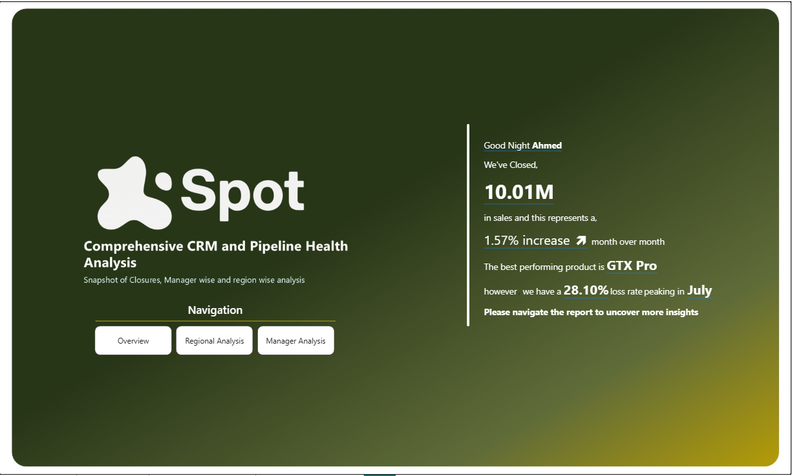
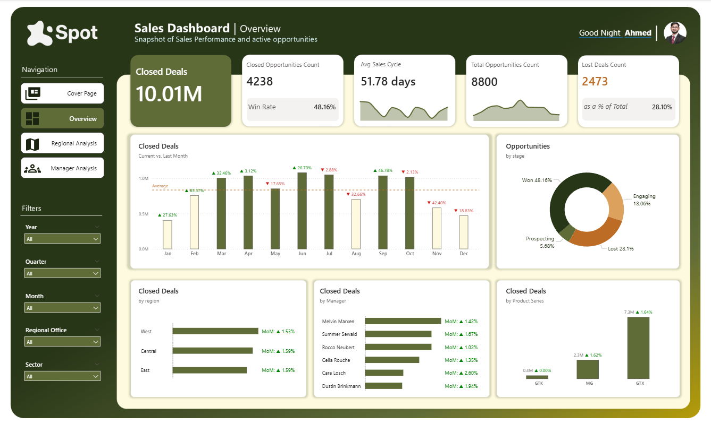
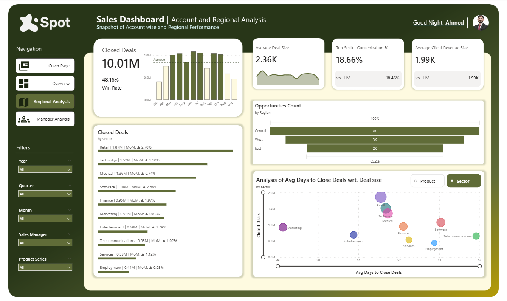

# Sales Pipeline Analytics Dashboard
### Power BI Portfolio Project | FP&A Focus

---

## Dashboard Preview

### Cover Page


### Overview


### Regional Analysis


### Manager Analysis


---

## Overview

This dashboard provides end-to-end visibility into a B2B sales pipeline — from opportunity creation through deal closure. Built as a portfolio project, it demonstrates FP&A-relevant analytical techniques including period-over-period comparisons, win/loss analysis, discount tracking, and dynamic visual storytelling.

The report is designed for sales leadership and finance teams who need to monitor pipeline health, assess team performance, and identify revenue risk through lost deals and discount leakage.

---

## Data Model

The model follows a **star schema** design with `sales_pipeline` as the central fact table, surrounded by four dimension tables.

```
Dim_Date ──────────────────┐
products ──────────────────┤
sales_teams ───────────────┼──► sales_pipeline (Fact)
accounts ──────────────────┘
```

**Fact Table — `sales_pipeline`**

| Column | Type | Description |
|---|---|---|
| opportunity_id | Text | Unique deal identifier |
| sales_agent | Text | Assigned sales rep (FK → sales_teams) |
| product | Text | Product sold (FK → products) |
| account | Text | Client account (FK → accounts) |
| deal_stage | Text | Current stage: Won / Lost / Engaging / Prospecting |
| engage_date | Date | Date opportunity was opened (FK → Dim_Date) |
| close_date | Date | Date deal was won or lost |
| close_value | Integer | Deal value at close |
| Discount Volume | Calculated | Computed discount amount per deal |

All relationships are **Many-to-One**, single direction, from the fact table to each dimension.

---

## DAX Measures (35 Total)

Measures are organized into six display folders:

**Core KPIs**
Closed Deals, Total Opportunities Count, Closed Opportunities Count, Lost Deals Count, Lost Deals Amount, Avg Days to Close Deals, Average Deal Size, Average Sale Price, Average Client Revenue Size, Total Discount Volume, Discount

**Period Comparison**
Closed Deals LM, vs. LM, vs. LM Chart Label, vs. LM Table Label, vs. LM Table Label 2, vs. LM Top Sector Comparison, vs. LM Avg Client Revenue Size

**Ratios & Percentages**
Closed Opportunities Count as a % of Total, Lost Deals Count as a % of Total, Max Product Amount as a % of Whole, Discount Variance %, Top Sector Concentration %

**Dynamic Visuals**
Dynamic Title Waterfall, Dynamic Highlight Waterfall, Dynamic Subtitle Bubble Chart

**Labels & Formatting**
Bar Chart Color, Avg Days to Close Deals Label, Text_Win Rate, Labels Placeholder, Label Bar Chart – Sector, Absolute Discount Volume Label, Absolute Discount Variance, Welcome Note Label, Name Placeholder

---

## Key Features

**Win/Loss Analysis** — Tracks win rate by count and value, loss rate, and lost deal amounts to surface revenue that didn't convert.

**MoM Period Comparison** — Every core KPI is paired with a last-month comparison using `DATEADD` time intelligence, displayed with ▲/▼ arrow indicators for at-a-glance trend reading.

**Discount Leakage Tracking** — Measures total discount volume, average sale price vs. deal size gap, and discount variance percentage to highlight margin risk.

**Dynamic Waterfall Chart** — Title and color highlighting adapt based on slicer context: when filtered by manager it shows their top product; when unfiltered it shows the top product's share of total revenue.

**Conditional Bar Coloring** — Bars in the closed deals by sector chart switch between dark green and light cream based on whether the sector is above or below the monthly average — no custom visuals required.

**Sector vs. Product Toggle** — A dedicated switch table (`Sector VS. Product Switch`) enables a field parameter that lets users toggle the breakdown axis between sector and product without changing the page.

---

## Tools & Techniques

- **Power BI Desktop** — Report authoring and data modeling
- **DAX** — All KPIs, time intelligence, dynamic titles, and conditional formatting
- **Star Schema** — Proper dimensional modeling with a clean fact/dimension separation
- **Field Parameters** — Dynamic axis switching between sector and product views
- **Bookmarks / Buttons** — Navigation and UX interactivity

---

## Files

```
PowerBI Project 1.pbix    # Main report file
README.md                 # This file
```

---

## About

Built by **Ahmed** as part of an FP&A-focused Power BI portfolio. This project demonstrates applied skills in data modeling, DAX measure development, and financial dashboard design — reflecting the analytical work done in a real FP&A analyst role.

Connect on [LinkedIn]((https://www.linkedin.com/in/muhammad-ahmed-saeed-2183131b4/)) | View more projects on [GitHub]((https://github.com/Ahmed-Saeed-FPnA))
